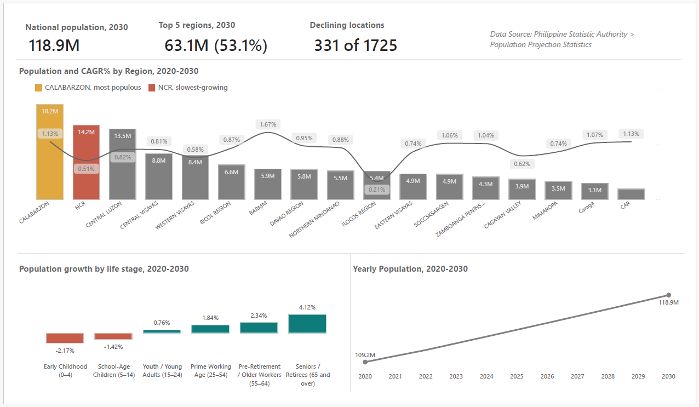
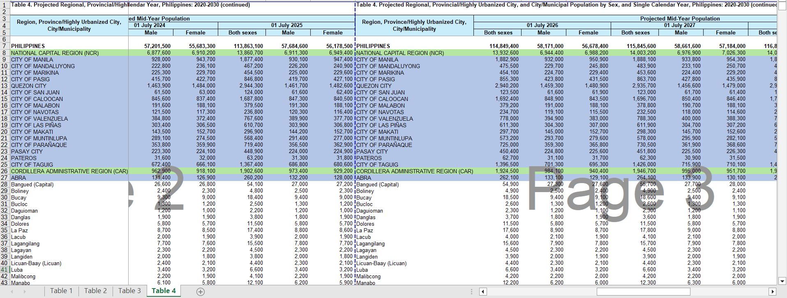
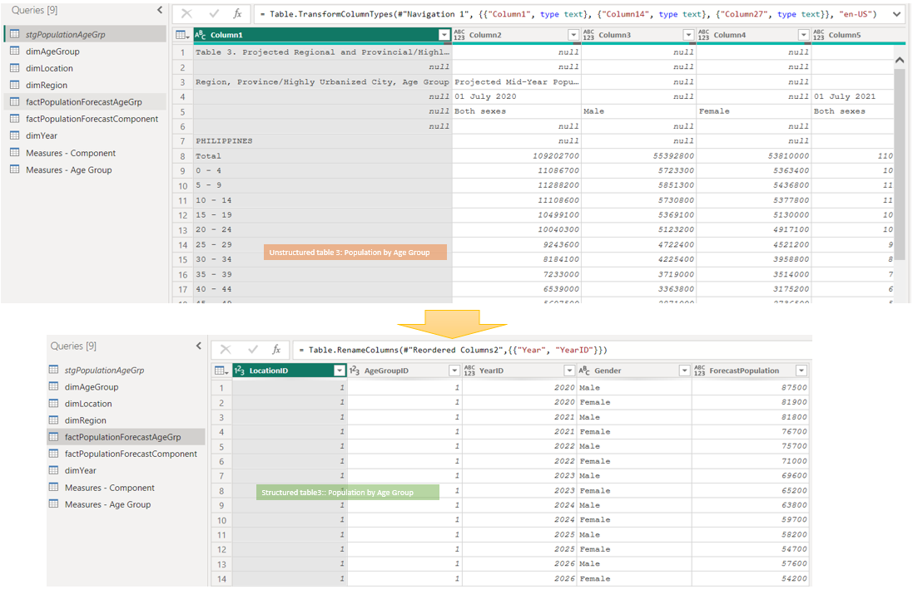
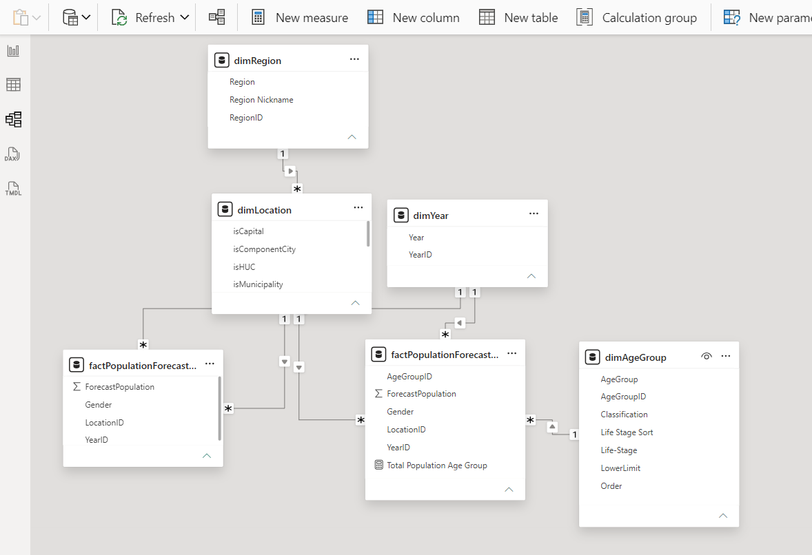

# Philippines Population Insights Dashboard (2020–2030)

A Power BI dashboard built on PSA (Philippine Statistics Authority) 2020 Census-based population projections, turning raw government demographic tables into decision-ready insights for **retail brands**, **real estate developers**, and **ad planners**.

[View the full report (PDF, 4 pages)](population-dashboard.pdf) **_Building in-progress_**

---

## The business problem

Population growth in the Philippines isn't evenly distributed — but most publicly available population data is published as static government tables, not as something a business can actually query for decisions. This project turns PSA's raw regional/provincial/city population projections into a queryable semantic model and a dashboard that answers a specific question for each buyer type:

- **Retail brands** — where is the growing, spending-age population actually landing?
- **Real estate developers** — where is housing demand forming, and where is it fading?
- **Ad planners** — how is the size and age mix of each regional audience shifting?

## The process

### 1. Raw source data

The source is PSA's published Excel tables (Table 3: region/province population by age group; Table 4: region/province/city population). As published, this data is **not analysis-ready**:
- Multiple merged header rows spanning several years per block
- A "wide," multi-block layout — the same location list repeated 3–4 times across the sheet, once per group of years
- No explicit hierarchy column indicating whether a row is a region, a province, or a city
- Region-level and province-level totals stored as their own rows, alongside their child rows — a structure that silently double-counts if aggregated naively

### 2. Cleaning in Power Query

Before any modeling could happen, the raw tables needed to be unpivoted and restructured — turning the wide, multi-block, mixed-grain source into a clean, single-grain long format:
- Unpivoted the repeated year-blocks into a proper `Year` column
- Removed header/footer/note rows that weren't part of the actual data
- Rebuilt the location hierarchy explicitly (Region → Province/HUC → City/Municipality) rather than relying on row position or text casing
- Normalized inconsistent naming between the two source tables (e.g. capitalization differences in the same city name across tables)

### 3. Data model (star schema)

The cleaned data was modeled as a star schema in Power BI:

| Table | Role |
|---|---|
| `dimLocation` | Region, Province/HUC, and City/Municipality/HUC attributes — single grain at Municipality/City/HUC level |
| `dimRegion` | Distinct region list, with a shortened `RegionNickname` for compact chart labels |
| `dimAgeGroup` | Age bands, with `Classification` (Young/Working/Elder) and `Life-Stage` groupings |
| `dimYear` | 2020–2030 |
| `factPopulationForecastComponent` | Population by location and year (city/municipality/HUC grain) |
| `factPopulationForecastAgeGrp` | Population by location, age group, and year |

Key modeling decisions:
- Both fact tables are kept at a **single grain** (lowest level only) — this avoids the double-counting risk baked into the raw source tables, since region/province totals are derived through the model rather than stored as separate rows
- A reusable DAX measure library (dynamic CAGR, growth %, dependency ratio, Top-N ranking, regional share) was built once and reused across every chart, rather than one-off calculations per visual

### 4. The dashboard

The Overview page above sets the macro narrative — from there, three dedicated pages go deeper for each buyer type (Retail brands, Real Estate developers, Ad planners), each with charts scoped to that audience's decisions.

## Key findings

- NCR ranks **last of 17 regions** in population growth (0.51% CAGR); CALABARZON — the largest region outside NCR — is absorbing the overflow (1.13% CAGR).
- Fertility is below replacement level — **children are the only shrinking age cohort** nationally; every cohort 15+ is growing, seniors fastest of all.
- The national dependency ratio falls from **56.4% to 45.4%** between 2020 and 2030 — a widening share of working-age Filipinos relative to dependents.
- 323 of 1,607 cities and municipalities are projected to **lose** population by 2030 — growth is not universal, even within fast-growing provinces.

## Tech stack

- **Source data**: PSA 2020 Census-Based Population Projections (Tables 3 & 4)
- **ETL**: Power Query (M)
- **Modeling & measures**: Power BI, DAX
- **Visualization**: Power BI Desktop

## Explore it yourself

- [Full report PDF](population-dashboard.pdf) — click through all four pages
- `population-dashboard.pbix` — the working Power BI file, if you'd like to open the model and measures directly
